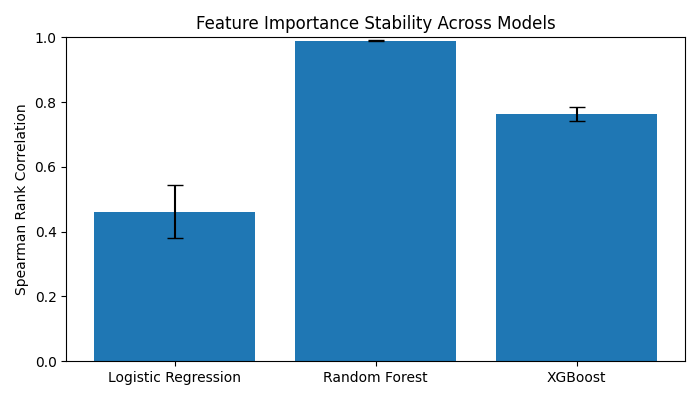

# Data-Centric Robustness Analysis of Machine Learning Models

This project presents a **systematic, data-centric empirical analysis** of how different forms of data corruption—**label noise**, **missing data**, and **feature noise**—affect both **predictive performance** and **feature importance stability** in tabular machine learning models.

Rather than optimizing accuracy alone, the study emphasizes **robustness and interpretability**, examining whether models remain reliable and explainable when trained or evaluated on imperfect data.

This work does **not propose new model architectures**. Instead, it provides a controlled empirical evaluation of robustness and explanation stability under realistic data quality degradations.

---

## Motivation

Real-world machine learning systems are rarely trained or deployed on clean, fully observed datasets.  
In practice:

- Labels may be incorrect or noisy  
- Feature values may be missing  
- Measurement and data-entry errors introduce noise  
- Small perturbations may alter model behavior  

While standard evaluation focuses on predictive accuracy, such metrics can **mask fragile decision logic and unstable explanations**.

This project instead investigates:

- **Robustness** of model performance under controlled data corruption  
- **Stability of feature importance explanations** as data quality degrades  

The goal is to assess whether models remain **trustworthy, interpretable, and reliable** beyond idealized clean-data settings.

---

## Research Questions

1. How does increasing **label noise** impact predictive performance and feature importance stability?
2. How robust are different model families to **missing data** after standard imputation?
3. How sensitive are feature importance rankings to **feature noise** and imperfect supervision?
4. Do different model classes exhibit distinct trade-offs between accuracy and explanation stability?

---

## Dataset

- **Adult Income Dataset** (UCI Machine Learning Repository)  
- Task: Binary classification (income >50K vs ≤50K)  
- Features: demographic, education, and employment-related attributes  

The dataset is widely studied, interpretable, and well-suited for controlled robustness experiments on tabular data.

---

## Experimental Setup

All robustness experiments evaluate models trained on **clean data**, with corruption applied either at **training time** (label noise) or **evaluation time** (feature corruption), unless explicitly stated otherwise.

### Models Evaluated

- **Logistic Regression (LR)** — linear, interpretable baseline  
- **Random Forest (RF)** — bagging-based ensemble model  
- **XGBoost (XGB)** — gradient-boosted decision trees  

These models represent increasing levels of complexity and non-linearity.

---

### Data Corruption Protocols

All corruptions are applied in a **controlled and reproducible** manner.

#### Label Noise
- Levels: 0%, 5%, 10%, 20%  
- Applied **only to training labels**  
- Simulates annotation errors and imperfect supervision  

#### Missing Data
- Levels: 0%, 5%, 10%, 20%  
- Missing Completely At Random (MCAR)  
- Followed by standard imputation  
- Applied at evaluation time  

#### Feature Noise
- Numerical features: additive noise proportional to feature variance  
- Categorical features: random category perturbations  
- Noise magnitudes preserve feature scale while introducing realistic perturbations  
- Simulates measurement and data-entry errors  

#### Combined Corruption
- Simultaneous application of missing data and feature noise  
- Evaluates interaction effects under realistic deployment conditions  

---

### Evaluation Metrics

- Accuracy  
- ROC-AUC  
- **Feature Importance Stability**
  - Measured via **Spearman rank correlation**
  - Computed across multiple retrainings and corruption levels  

All experiments are repeated with **multiple random seeds** and fixed preprocessing pipelines to ensure statistical reliability and fair comparison.

---

## Experiments Conducted

1. Clean baseline performance evaluation  
2. Robustness under label noise  
3. Robustness under missing data  
4. Robustness under feature noise  
5. Robustness under combined data corruption  
6. Feature importance stability under label noise (LR, RF, XGB)  
7. Cross-model comparison of explanation stability  

---

## Key Findings

- Predictive performance degrades **gradually** under data corruption, masking deeper instability.
- Feature importance rankings are **substantially more sensitive** to corruption than accuracy metrics.
- **Logistic Regression** exhibits low explanation stability, indicating sensitivity to small data perturbations.
- **Random Forest** produces highly stable feature importance rankings, even under significant corruption.
- **XGBoost** improves stability relative to linear models but remains less stable than Random Forest.
- Models with similar accuracy can differ significantly in **explanation reliability**.

These results demonstrate that **strong predictive performance does not guarantee robust or trustworthy explanations**.

---

## Feature Importance Stability Across Models



---

## Reproducibility

All experiments are fully reproducible from raw data using fixed preprocessing pipelines.

The repository includes:
- Fixed preprocessing pipelines  
- Controlled data corruption protocols  
- Multi-seed evaluation  
- Clear separation between experiment logic and results  

### Run Experiments

```bash
python -m src.experiments.run_label_noise
python -m src.experiments.run_missing_data
python -m src.experiments.run_feature_importance_stability
python -m src.experiments.run_feature_importance_stability_rf
python -m src.experiments.run_feature_importance_stability_xgb
